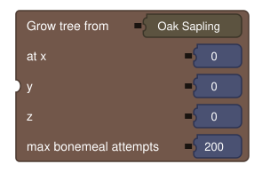
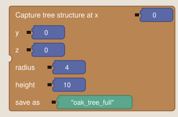
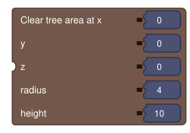
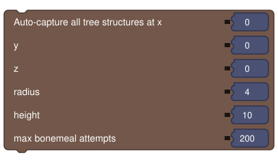

# Generation

Dev-time tools for building the `.nbt` structure files that [Render Tree Structure Overlay](Renderers#render-tree-structure-overlay) renders. These are **not** meant to ship as part of normal gameplay logic — wire them into a **Command** element you create yourself (e.g. `/generatetrees`), since these blocks take explicit `x`/`y`/`z` inputs rather than an implicit target block (a command has no inherent target block).

> The block images below are approximate mockups (generated from each block's actual definition, not real screenshots) — useful for seeing every field at a glance, but MCreator's real rendering will differ in exact styling.

---

## Grow Tree From (via bonemeal)



```
Grow tree from %sapling at x %pos_x y %pos_y z %pos_z max bonemeal attempts %max_attempts
```

Places the given sapling/fungus/propagule item and repeatedly applies the same growth logic real bonemeal uses until it becomes a tree or `max_attempts` is reached. Returns `true` if it grew. Dark oak and pale oak are automatically planted as a 2×2 group, since vanilla only grows those from a 2×2 sapling arrangement — a single sapling of either type never grows no matter how many attempts.

---

## Capture Tree Structure



```
Capture tree structure at x %pos_x y %pos_y z %pos_z radius %radius height %height save as %structure_name
```

Saves a `(radius*2+1)`-square region centered on x/z, starting at y, as a `.nbt` structure — the same routine a vanilla Structure Block's "Save" button uses. `height` is a **scan ceiling**, not the literal saved height: the block scans upward for the actual topmost non-air block within that ceiling and trims the capture to it, so no empty air is saved above the tree. The file lands in the current world save's `generated/<modid>/structure/<name>.nbt`; copy it into the workspace's Structures panel afterward to use it with the tree structure overlay.

---

## Clear Tree Area



```
Clear tree area at x %pos_x y %pos_y z %pos_z radius %radius height %height
```

Sets every block in the same region **Capture Tree Structure** would use back to air. Run this before growing the next tree at the same spot, using the same x/y/z/radius/height values you captured with.

---

## List All Tree Sapling Items


```
List all tree sapling items
```

Scans the item registry for everything that grows into a tree: any block extending `SaplingBlock` (covers vanilla saplings and most modded tree saplings), plus the vanilla growers that don't extend it — mangrove propagule, azalea, flowering azalea, crimson fungus, warped fungus. Returns a list of one-count item stacks. Not included: bamboo and other continuously-growing blocks that don't produce a single discrete tree shape.

---

## Auto-Capture All Tree Structures



```
Auto-capture all tree structures at x %pos_x y %pos_y z %pos_z radius %radius height %height max bonemeal attempts %max_attempts
```

The one-block version of the whole pipeline: loops every item from **List All Tree Sapling Items**, and for each one clears the area, grows it via bonemeal, saves it as a structure if it grew, then clears the area again before moving to the next species. Each structure is filed under its own source mod — `generated/<modid>/structure/<sapling_modid>/<sapling_modid>_<sapling_item>.nbt` — so a modded sapling sorts into its own folder automatically.

### Typical workflow

1. Create a Command element in MCreator (e.g. `/generatetrees`).
2. Wire in **Auto-Capture All Tree Structures** with a fixed test spot, a radius/height generous enough for the tallest tree you expect, and a safe max-attempt count (200 is a reasonable default).
3. Run the command in a test world. Check the game log and the `generated/<modid>/structure/` folder in that world's save for the captured `.nbt` files.
4. Import the ones you want into the workspace's Structures panel.
5. Use [Structure Selector](Utils#structure-selector) (or a text/variable input) on **Render Tree Structure Overlay** to preview them.
