# Renderers

Every block on this page renders something on the Block Overlay element's target block and lives in the **Renderers** toolbox subcategory. None of them need coordinate inputs — the target block's position is supplied automatically. Most read a `placement`/`side` pair from the [Utils](Utils) blocks; see that page for the 3×3 anchor grid and direction helpers.

> The block images below are approximate mockups (generated from each block's actual definition, not real screenshots) showing external-inputs layout with example values plugged in — useful for seeing every field at a glance, but MCreator's real rendering will differ in exact styling.

---

## Render Text

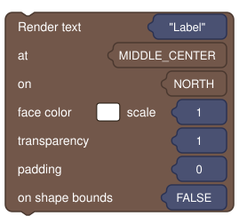

```
Render text %text at %placement on %side face color %color scale %scale transparency %transparency padding %padding on shape bounds %bounds
```

| Input | Meaning |
|---|---|
| `text` | The string to display. |
| `placement` | One of the 9 anchors — see [Utils § Overlay Placement](Utils#overlay-placement). |
| `side` | The `Direction` face to render on — use `{Front}` for the face the player is looking at, or a fixed constant for orientation-stable text. |
| `color` | Color picker. |
| `scale` | Multiplier; `1` is native size. Text automatically shrinks to fit within the target block. |
| `transparency` | `0` (invisible) to `1` (opaque). |
| `padding` | Pixels inset from the anchored edge. |
| `bounds` | `true` clips to the block's actual shape bounds (useful for slabs/partial blocks); `false` can spill past the face edge. |

---

## Render Number

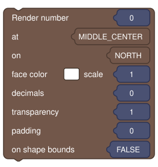

Identical layout to **Render text**, but takes a `Number` and a `decimals` input controlling how many digits after the decimal point to show. Useful for live readouts (e.g. `Energy: 4200`).

---

## Render Item

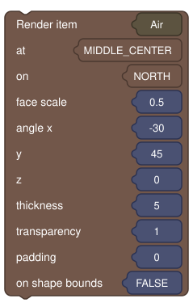

```
Render item %item at %placement on %side face scale %scale angle x %angle_x y %angle_y z %angle_z thickness %thickness transparency %transparency padding %padding on shape bounds %bounds
```

Renders a static 3D item graphic anchored to a placement/side. `angle x/y/z` rotate the item in place; `thickness` controls how "flat" the item render is squashed toward the face. If you want the item to spin, use **Render spinning item** or **Render center spinning item** instead.

---

## Render Variable Item

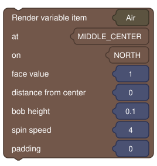

```
Render variable item %item at %placement on %side face value %value distance from center %distance bob height %bob_height spin speed %spin_speed padding %padding
```

A spinning, bobbing item where `value` (`0`–`1`) drives its scale — handy for a progressive indicator (e.g. an item that grows as a charge/quantity variable increases from `0` to `1`) rather than a fixed always-full-size item. `distance from center` offsets it outward along the face normal, in blocks; `bob_height` adds a gentle up/down float; `spin_speed` is in degrees/sec.

---

## Render Spinning Item

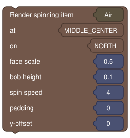

```
Render spinning item %item at %placement on %side face scale %scale bob height %bob_height spin speed %spin_speed padding %padding y-offset %offset_y
```

Like **Render item**, but continuously rotates around its vertical axis at `spin_speed` degrees/sec, with an optional gentle vertical bob (`bob_height`).

---

## Render Center Spinning Item

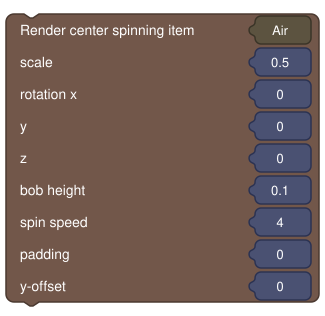

```
Render center spinning item %item scale %scale rotation x %angle_x y %angle_y z %angle_z bob height %bob_height spin speed %spin_speed padding %padding y-offset %offset_y
```

A specialized spinner that always renders at the block's center regardless of placement — best for fully symmetrical items (coins, ingots, gears) where face/anchor alignment doesn't matter.

---

## Render Block Texture

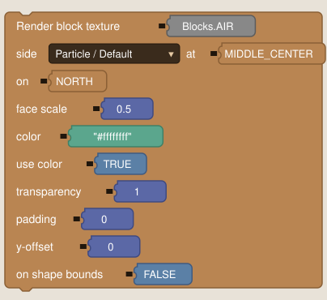

```
Render block texture %texture side %block_side at %placement on %side face scale %scale color %color use color %use_color transparency %transparency padding %padding y-offset %offset_y on shape bounds %bounds
```

Renders a workspace **Texture** (see [Utils § Texture Selector](Utils#texture-selector)) tinted and lit like an in-world item texture. `block_side` (Particle/Default, Up, Down, North, South, East, West) chooses which face of a *block*-type texture to sample, independent of `side`, which is the face of the *target block* the overlay itself renders on. `use_color` toggles whether `color` tints the texture at all (leave off for the texture's native colors); `color` accepts hex with alpha (`#ffffffff` or `#80ffffff`).

---

## Render Screen Texture

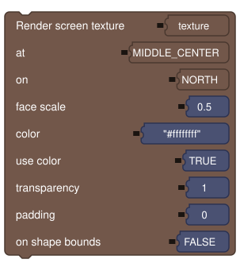

Same parameter shape as **Render block texture**, but its texture input comes from the [Screen Texture Selector](Utils#screen-texture-selector) — GUI/screen textures rather than block/item/entity textures.

---

## Render Precise Text

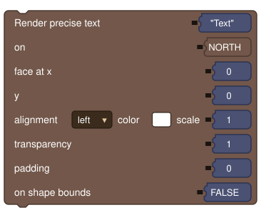

```
Render precise text %text on %side face at x %coord_x y %coord_y alignment %alignment color %color scale %scale transparency %transparency padding %padding on shape bounds %bounds
```

Like **Render text**, but positioned with explicit `x`/`y` pixel coordinates on the face instead of the 9-anchor grid, plus an `alignment` dropdown (`left` / `center` / `right`) controlling how the text sits relative to that point. Use this when you need full manual control over a decal's position — e.g. multiple labels packed tightly on one face.

---

## Render Crop Overlay

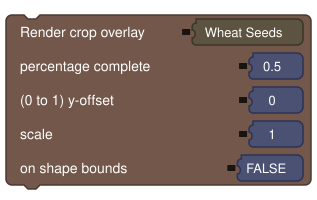

```
Render crop overlay %crop percentage complete %percentage (0 to 1) y-offset %offset_y scale %scale on shape bounds %bounds
```

Takes a seed/stem/crop item (wheat seeds, pumpkin seeds, melon seeds, carrots, sweet berries, flowers, and similar) and automatically renders the correct growth-stage model for `percentage`, without you hand-rolling the growth-stage math yourself. Supports shape bounds and a Y-offset for sitting correctly on farmland, pots, slabs, or custom blocks.

---

## Render Tree Overlay

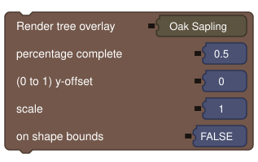

```
Render tree overlay %tree percentage complete %percentage (0 to 1) y-offset %offset_y scale %scale on shape bounds %bounds
```

The single-block counterpart of the tree structure overlay below — takes a sapling or tree-type item (Oak Sapling, Spruce Sapling, Bamboo, Crimson Fungus, etc.) and renders it scaled to `percentage` and a maximum `scale`. For a full multi-block tree hologram (trunk + canopy), use **Render tree structure overlay** instead.

---

## Render Tree Structure Overlay

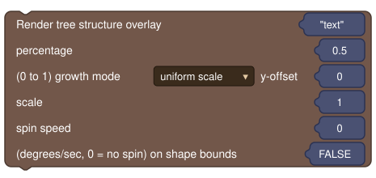

```
Render tree structure overlay %structure percentage %percentage (0 to 1) growth mode %growth_mode y-offset %offset_y scale %scale spin speed %spin_speed (degrees/sec, 0 = no spin) on shape bounds %bounds
```

Renders a captured multi-block tree — trunk, branches, and canopy, not just a single scaled block — as an in-world hologram. See [Generation](Generation) for how to capture the `.nbt` files this block reads.

| Input | Meaning |
|---|---|
| `structure` | Accepts the [Structure Selector](Utils#structure-selector) picker, a plain text block, or any `String` expression — so it can be chosen at design time or computed at runtime. |
| `percentage` | Growth amount, `0` to `1`. |
| `growth_mode` | `uniform scale` grows/shrinks the whole structure together as percentage changes. `bottom-up reveal` keeps the structure at full size and reveals more of it from the ground up as percentage increases — a literal "growing out of the ground" look. |
| `scale` | Size of the structure's **longest axis**, in blocks. `1` means the entire structure fits inside one block's bounding cube, matching the single-block tree overlay's convention. |
| `spin_speed` | Rotation around the structure's own vertical axis, degrees/sec (`0` = no spin). |
| `bounds` | Anchor to the target block's actual shape bounds instead of a full cube. |

The hologram centers itself on the target block regardless of how lopsided the tree's canopy is (based on the structure's own declared capture footprint, not the placed blocks' bounding box), and biome-tinted blocks (leaves, vines, etc.) render with the correct tint for the overlay's actual biome.

---

## Render Entity Overlay

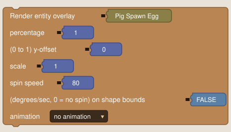

```
Render entity overlay %spawn_egg percentage %percentage (0 to 1) y-offset %offset_y scale %scale spin speed %spin_speed (degrees/sec, 0 = no spin) on shape bounds %bounds animation %animation
```

Renders a live-model hologram of the entity a spawn egg item would spawn (e.g. Zombie Spawn Egg, Pig Spawn Egg). The entity is created but never added to the world, so it has no AI, pathing, or collision — a pure client-side preview that works identically in singleplayer and on a dedicated server.

| Input | Meaning |
|---|---|
| `spawn_egg` | An `MCItem` input; must resolve to a spawn egg item. |
| `percentage` | Growth-scale amount, `0` (tiny) to `1` (full `scale` size). |
| `offset_y` | Vertical offset in pixels. |
| `scale` | `1` means the entity's longest dimension (width or height) fits in exactly one block — matches the tree structure overlay's scale convention rather than the entity's real-world size. |
| `spin_speed` | Rotation around the entity's own vertical axis, degrees/sec (`0` = no spin). |
| `bounds` | Anchor to the target block's actual shape bounds instead of a full cube. |
| `animation` | `No animation` (idle pose) / `Look around` (irregular, natural-looking head sweep) / `Walk` (plays the entity's own walk cycle in place). |

Only one preview entity is created per entity type and reused across every overlay of that type — several instances of the same mob on screen share one cached entity rather than creating a new one per block per frame.

---

## Render Target Block Outline

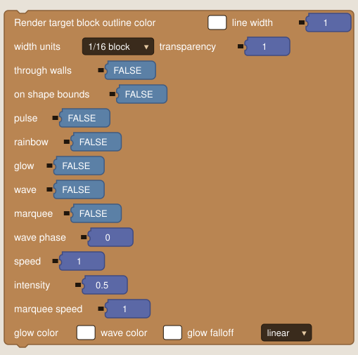

```
Render target block outline color %color line width %width width units %width_units transparency %transparency through walls %through_walls on shape bounds %bounds pulse %pulse rainbow %rainbow glow %glow wave %wave marquee %marquee wave phase %wave_phase speed %speed intensity %intensity marquee speed %marquee_speed glow color %glow_color wave color %wave_color glow falloff %glow_falloff
```

Renders a colored wireframe around the target block's bounds.

| Input | Meaning |
|---|---|
| `color` | Base outline color (color picker). |
| `width` | Line thickness, in whichever unit `width_units` selects. |
| `width_units` | `1/16 block` (fixed world-space thickness) or `pixel` (constant screen-space thickness, computed per-frame from camera distance + FOV). |
| `transparency` | `0`–`1` (`1` = fully opaque). |
| `through_walls` | Render even when occluded by other blocks. |
| `bounds` | Follow the target block's actual shape bounds (slabs, stairs, etc.) instead of a full cube. |

Optional animated effects layer on top of the base outline, each independently toggleable with its own tuning inputs:

- **`pulse`** — breathing opacity.
- **`rainbow`** — cycling hue.
- **`glow`** — a soft additive halo, with its own `glow_color` and `glow_falloff` curve (`linear` / `exponential` / `steep`).
- **`wave`** — a bright band traveling around the outline, with its own `wave_color`, `wave_phase`, and `speed`.
- **`marquee`** — a moving dashed/scanning band, crawling continuously at `marquee_speed`.

`intensity` scales the strength of the time-based effects, and effects can be combined (e.g. `glow` + `pulse` together).
