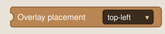
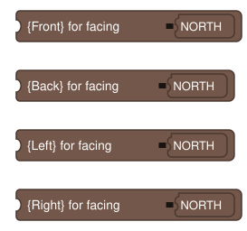
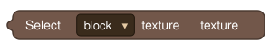
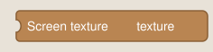
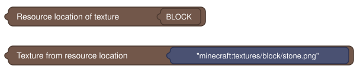
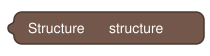
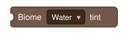
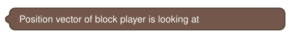

# Utils

Helper blocks that feed the [Renderers](Renderers) — placement, direction, texture/structure pickers, biome tint, and the looked-at block's position. None of these render anything by themselves.

> The block images below are approximate mockups (generated from each block's actual definition, not real screenshots) — useful for seeing every field at a glance, but MCreator's real rendering will differ in exact styling.

---

## Overlay Placement



```
Overlay placement %placement
```

A dropdown over the plugin's reusable **3×3 anchor grid**, used by every face-aligned Renderer block's `placement` input:

```
TOP_LEFT     TOP_CENTER     TOP_RIGHT
MIDDLE_LEFT  MIDDLE_CENTER  MIDDLE_RIGHT
BOTTOM_LEFT  BOTTOM_CENTER  BOTTOM_RIGHT
```

Left placements align the content's left edge, center placements center it, right placements align its right edge; top/middle/bottom apply the equivalent vertical alignment. The grid is consistent across full-block and per-face placements, so switching a layout between "whole block" and "single face" doesn't require recomputing positions. You can build layered HUDs by combining multiple anchors in one Overlay logic procedure — e.g. `TOP_LEFT` = item icon, `TOP_CENTER` = name, `TOP_RIGHT` = a number readout.

---

## Direction Helpers



Four blocks, each taking a `Direction` (`facing`) and returning a `Direction`:

| Block | Returns |
|---|---|
| `{Front}` for facing | `facing` itself. |
| `{Back}` for facing | The opposite of `facing`. |
| `{Left}` for facing | `facing` rotated 90° clockwise. |
| `{Right}` for facing | `facing` rotated 90° counter-clockwise. |

Use `{Front}` on a `side` input for overlays that should always face the player regardless of how the block is oriented, or a fixed `Direction` constant for orientation-stable overlays. `{Left}`/`{Right}` are intended for horizontal facings.

---

## Texture Selector



```
Select %category texture %texture
```

Opens MCreator's native, visual texture-picker dialog scoped to a category (block, item, entity, effect, particle, armor, or other workspace image). Returns a typed **`Texture`** value — the plugin's own datatype — with an image preview shown directly on the block.

---

## Screen Texture Selector



```
Screen texture %texture
```

Same picker mechanism as **Texture Selector**, scoped specifically to GUI/screen textures, for use with [Render Screen Texture](Renderers#render-screen-texture).

---

## Texture ↔ Text Conversion



Two blocks for round-tripping between the `Texture` datatype and plain resource-location strings:

```
Resource location of texture %texture   → String
Texture from resource location %location → Texture
```

Useful when a texture needs to be computed at runtime (e.g. built from a variable) rather than picked at design time — build the resource-location string, then convert it into a `Texture` right before feeding a Renderer block.

---

## Structure Selector



```
Structure %structure
```

A double-click picker (like the texture selector) listing every `.nbt` structure already imported into the workspace's Structures panel. Returns a `String` — the exact name to plug into [Render Tree Structure Overlay](Renderers#render-tree-structure-overlay)'s `structure` input, or into any of the [Generation](Generation) capture blocks.

---

## Biome Tint



```
Biome %channel tint
```

Returns the current biome's smoothed **Water**, **Grass**, or **Foliage (Leaves)** tint at the Block Overlay element's target block, as a hex color string (e.g. `#5f9c46`) — the same blended color vanilla uses when tinting those blocks, so it matches what the biome actually looks like at that spot instead of a flat per-biome constant.

Plug this directly into any **color** input on a Renderer block — no extra wiring needed, since it reads the target block's position automatically. Because of that, it only works inside a Block Overlay element's Overlay logic procedure; dropping it into an unrelated procedure will fail to generate.

Typical uses: tint a texture overlay on a water-adjacent block to match the surrounding water color, or color a foliage-themed overlay to match the current biome's leaf tint instead of a fixed green.

---

## Position Vector of Looked-At Block



```
Position vector of block player is looking at
```

Returns a `Vec3` for the block the player is currently targeting. Useful for feeding coordinates into logic outside the automatic per-target-block flow — e.g. a Command element that needs to know what the player is looking at right now.
